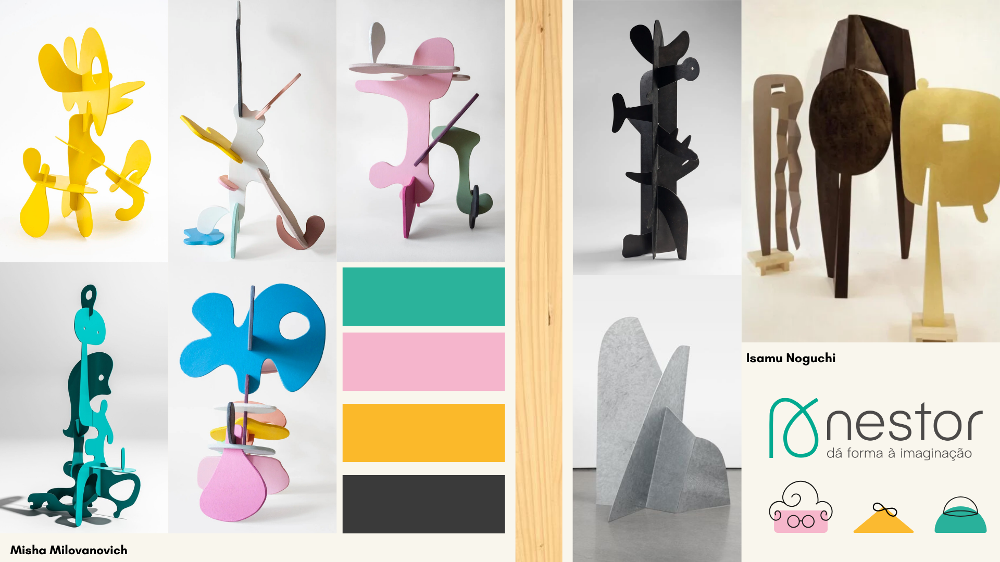

# Contexto de Design

Página explicativa do contexto, em concordância com a apresentação produzida em grupo. Componente de **grupo**.

## 1. Resumo / Abstract

### Resumo (PT)

A marca Nestor foi desenvolvida com o objetivo de criar uma experiência lúdica e inclusiva para diferentes gerações, estabelecendo uma ligação entre crianças e idosos através do brincar. Os produtos apresentados na galeria partilham uma temática comum centrada no desenvolvimento motor, na criatividade e na interação social, promovendo momentos de aprendizagem e diversão para utilizadores de diferentes idades.
O conceito da marca baseia-se na ideia de que o brincar não deve estar limitado à infância, mas pode constituir uma ferramenta valiosa para estimular capacidades cognitivas, motoras e criativas ao longo de toda a vida. Desta forma, os brinquedos Nestor foram concebidos para serem utilizados tanto por crianças como por pessoas idosas, incentivando atividades que favorecem a coordenação motora, a destreza manual, a imaginação e a resolução de problemas. Esta abordagem intergeracional permite criar momentos de partilha e cooperação entre diferentes faixas etárias, fortalecendo relações e promovendo o bem-estar de todos os utilizadores.
Um dos elementos que une toda a coleção é a sua linguagem visual. Os brinquedos apresentam formas fluidas e orgânicas inspiradas no trabalho da artista Misha Milovanovich. Esta referência estética traduz-se em peças harmoniosas, suaves e apelativas, capazes de despertar a curiosidade e o interesse dos utilizadores. As linhas arredondadas e os volumes equilibrados contribuem para uma experiência sensorial agradável, ao mesmo tempo que reforçam a identidade visual da marca.
Outro aspeto comum aos produtos é a sua versatilidade de utilização. Os brinquedos foram pensados para permitir diferentes formas de brincar, adaptando-se às capacidades, interesses e criatividade de cada utilizador. Não existe apenas uma maneira correta de utilizar os objetos, sendo incentivada a exploração livre e a descoberta de novas possibilidades. Esta característica estimula a autonomia, a experimentação e a imaginação, valores fundamentais para o desenvolvimento pessoal e criativo.
A coleção inclui ainda cartões complementares que acompanham os brinquedos e ampliam as suas potencialidades lúdicas. Estes cartões podem ser utilizados como apoio a atividades e desafios estruturados, orientando determinadas brincadeiras e promovendo objetivos específicos de aprendizagem e desenvolvimento motor. No entanto, também podem ser utilizados de forma livre, permitindo que as crianças construam as suas próprias estruturas, inventem jogos ou criem novas formas de interação com os brinquedos. Esta combinação entre orientação e liberdade criativa torna a experiência mais rica e adaptável a diferentes contextos e utilizadores.
Em síntese, todos os produtos da marca Nestor encontram-se ligados por uma visão comum que valoriza a criatividade, a inclusão e o desenvolvimento humano. Através de um design inspirado na arte contemporânea, de funcionalidades abertas à exploração e de uma forte componente intergeracional, a marca procura criar brinquedos que promovam o crescimento, a aprendizagem e a partilha entre crianças e idosos, transformando o ato de brincar numa experiência significativa para todas as idades.

### Abstract (EN)

The Nestor brand was developed with the goal of creating a playful and inclusive experience for different generations, establishing a connection between children and older adults through play. The products presented in the gallery share a common theme focused on motor development, creativity, and social interaction, promoting moments of learning and enjoyment for users of different ages.

The brand’s concept is based on the idea that play should not be limited to childhood but can serve as a valuable tool for stimulating cognitive, motor, and creative abilities throughout life. For this reason, Nestor toys were designed to be used by both children and older adults, encouraging activities that enhance motor coordination, manual dexterity, imagination, and problem-solving skills. This intergenerational approach creates opportunities for sharing and cooperation between different age groups, strengthening relationships and promoting the well-being of all users.

One of the elements that unifies the entire collection is its visual language. The toys feature fluid and organic forms inspired by the work of artist Misha Milovanovich. This aesthetic reference is reflected in harmonious, soft, and appealing pieces that spark users’ curiosity and interest. The rounded lines and balanced volumes contribute to a pleasant sensory experience while reinforcing the brand’s visual identity.

Another common aspect of the products is their versatility. The toys were designed to allow for multiple ways of playing, adapting to each user’s abilities, interests, and creativity. There is no single correct way to use the objects; instead, free exploration and the discovery of new possibilities are encouraged. This characteristic promotes autonomy, experimentation, and imagination—fundamental values for personal and creative development.

The collection also includes complementary cards that accompany the toys and expand their playful potential. These cards can be used to support structured activities and challenges, guiding specific forms of play while promoting targeted learning objectives and motor development. However, they can also be used freely, allowing children to build their own structures, invent games, or create new ways of interacting with the toys. This combination of guidance and creative freedom makes the experience richer and more adaptable to different contexts and users.

In summary, all Nestor products are connected by a shared vision that values creativity, inclusion, and human development. Through a design inspired by contemporary art, open-ended functionality, and a strong intergenerational component, the brand seeks to create toys that promote growth, learning, and meaningful interaction between children and older adults, transforming play into a valuable experience for all ages.

## 2. Referências Coletivas

### 2.1. Recolha de Objetos a Redesenhar/Remisturar

Catálogo de objetos de partida que o grupo identificou para o redesenho. Para cada objeto: imagem, origem, motivo da escolha.

- **Objeto 1** — origem / autoria / razão da escolha
- **Objeto 2** — ...

### 2.2. Moodboard

Painel de referências visuais e conceptuais que orientaram a estratégia do nosso grupo.

