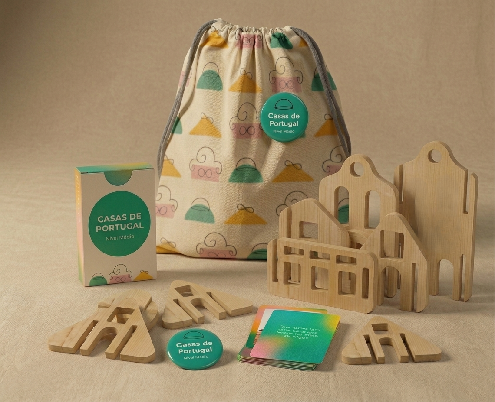
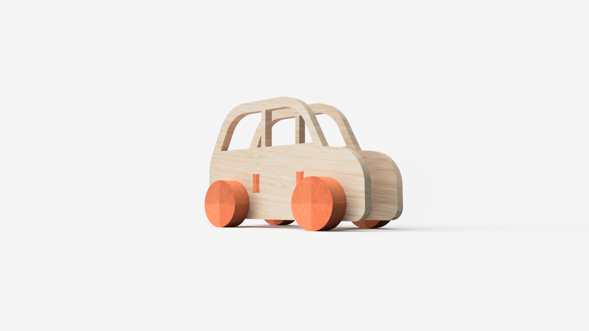

# Dá forma à imaginação

> Substituam este parágrafo por uma frase de apresentação do grupo (uma linha, conceptualmente forte). A imagem de capa acima (`attachments/hero.jpg`) deve ser uma **fotografia de conjunto** dos trabalhos do grupo, mais conceptual, que espelhe a estratégia coletiva.

## Elementos do Grupo

| Número  | Nome          |
| ------- | ------------- |
| 2024297 | Filipa Puna   |
| 2024289 | Luna Burgos   |
| 2024347 | Marta Valério |

---

## Contexto de Design
Nesta zona pretenderão mostrar o que relaciona estes produtos que apresentam na galeria - a temática, conceito comum, objectivos comuns, brincadeiras (funções) comuns, entre outros...
(devem colocar imagens no corpo a qq momento, bastará que as arrastem para aqui.)

Resumo, referências coletivas e moodboard do grupo encontram-se em [contexto.md](contexto.md).

[Ver contexto completo →](contexto.md)

---

## Galeria de Produtos

<!-- Cada thumbnail liga à página individual de cada produto.
     Cada produto vive em produtos/<numero>-<nome>/index.md
     e tem uma sub-página produtos/<numero>-<nome>/processo.md -->

<!-- markdownlint-disable MD033 -->

  <!-- duplicar o bloco abaixo para cada produto do grupo -->

  <a class="gallery-card" href="produtos/_modelo/">
    
    <h3>Casas de Portugal</h3>
    
Filipa Puna

  </a>
    <a class="gallery-card" href="produtos/Filipa/">
    
    <h3>Casas de Portugal</h3>
    
Filipa Puna

  </a>
    <a class="gallery-card" href="produtos/Luna/">
    
    <h3>Desafia-te!</h3>
    
Luna Burgos

  </a>
    <a class="gallery-card" href="produtos/Marta/">
    
    <h3>Jogo das Silhuetas</h3>
    
Marta Valério

  </a>

  <!-- duplicar o bloco acima para cada produto do grupo  e substituir _modelo em ambas por <numero>-<nome> -->

<!-- markdownlint-enable MD033 -->
