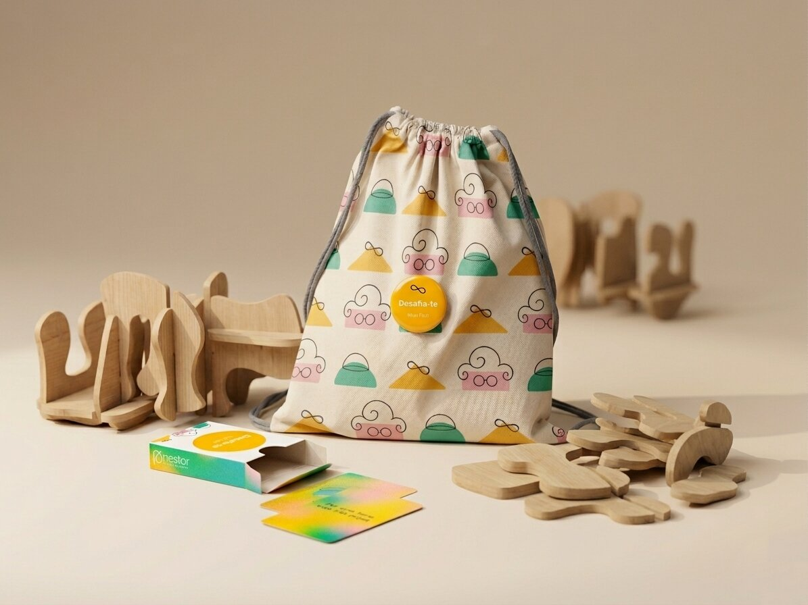

# Desafia-te!

<!--
  HERO: idealmente uma pseudo-sessão fotográfica do produto
  (ver tutorial Pletor.ai nos Recursos da disciplina, em
  /Recursos/AI_exps/). Usa attachments/hero.jpg para o frontmatter.
-->

Combina formas orgânicas e encaixes deslizantes para dar vida a desafios criativos.

## Conceito

"Desafia-te!" é um jogo de raciocínio e percepção espacial composto por 20 peças de madeira com formas orgânicas e encaixes deslizantes, das quais 7 possuem dois encaixes paralelos e as restantes apenas um. É acompanhado por um baralho de cartas com desafios simples para guiar a construção.

**O que é:** Um jogo de montagem livre, mas orientado, em que cada carta propõe um pequeno desafio, como "Faz uma torre com 3 peças" incentivando a criatividade dentro de um objetivo concreto.

**Para quem:** Crianças a partir dos 4/5 anos, jovens, adultos e idosos que procuram uma atividade estimulante e relaxante ao mesmo tempo.

**Porquê:** O produto combina liberdade criativa com um propósito claro, incentivando a experimentação e o pensamento lateral. Ao testar diferentes combinações de encaixes e equilíbrios, promove a concentração, a coordenação motora fina e a capacidade de resolver problemas de forma intuitiva, sem a pressão de uma única solução "certa".

## Enquadramento

O projeto insere-se no contexto do grupo através da exploração de formas modulares irregulares e curvas, partindo da análise de brinquedos de construção modular, do trabalho da artista Misha Milovanovich e do sistema TomTect, utilizando estas referências formais como ponto de partida para o processo de redesenho. 

No âmbito da marca Nestor, o trabalho individual desenvolveu-se nesta linha, propondo um novo sistema de encaixes deslizantes integrados diretamente nas peças de madeira, eliminando o uso de conectores de plástico e simplificando o processo construtivo. É a partir deste enquadramento que surge o "Desafia-te!", composto por 20 peças de madeira com formas orgânicas e encaixes deslizantes e acompanhado por um baralho de cartas.

O jogo combina liberdade criativa com um propósito concreto, sendo destinado a um público amplo, desde crianças a partir dos 4/5 anos até idosos, promovendo a concentração, a coordenação motora fina e o raciocínio lógico de forma intuitiva e lúdica. (ver [contexto](../../contexto.md))

## Tecnologia

Materiais (espécie de madeira): Pinus https://www.redepro.com/p/10092193/compensado-pinus-10mm-250-x-160-drabecki, processos de fabrico: CNC, software paramétrico: Autodesk Fusion 360. 

- Modelo 3D: [<!-- embed Fusion ou link a360.co -->](https://a360.co/3SCzjFr)

## Função

**Como se brinca?:** O "Desafia-te!" oferece duas modalidades de jogo. Na brincadeira livre, o jogador explora as 20 peças sem regras definidas, combinando-as livremente graças ao sistema de encaixes deslizantes, o que estimula a imaginação espacial e a experimentação. Na opção de jogo com cartas, o baralho propõe pequenos desafios como "Faz uma torre com 3 peças", orientando a construção sem limitar a criatividade.

**Idade:** 4/5 - 99 anos

**Montagem:** As 20 peças com formas orgânicas utilizam um sistema de encaixe deslizante intuitivo. 7 peças possuem dois encaixes paralelos, permitindo ramificações na construção, enquanto as restantes têm um único encaixe. As peças deslizam suavemente através de ranhuras que guiam o movimento natural das mãos, sem necessidade de ferramentas, parafusos ou colas, estimulando a coordenação motora fina e o raciocínio espacial. O sistema garante estabilidade imediata das estruturas construídas.

**Conformidade com a Diretiva 2009/48/CE:** O brinquedo foi concebido segundo princípios de segurança infantil, eliminando cantos vivos e recorrendo a formas arredondadas e superfícies devidamente polidas, sem risco de farpas ou lascas. As peças apresentam dimensões suficientemente grandes para evitar riscos de asfixia, cumprindo os critérios relativos a pequenas partes. Os encaixes deslizantes foram desenvolvidos com tolerâncias controladas, prevenindo o entalamento ou compressão dos dedos durante a utilização. A espessura e resistência das peças asseguram durabilidade e reduzem a possibilidade de fratura em caso de queda ou impacto. Os materiais utilizados não incluem substâncias tóxicas nem tratamentos químicos nocivos, respeitando os requisitos da norma EN 71, garantindo segurança no contacto dérmico e oral.

## Apresentação

Imagens-chave que sintetizam o produto final.

---

## Processo

O percurso completo de iterações, modelos e pesquisa está em [processo.md](processo.md), organizado do **mais recente** para o **mais antigo**.

[Ver processo completo →](processo.md)
