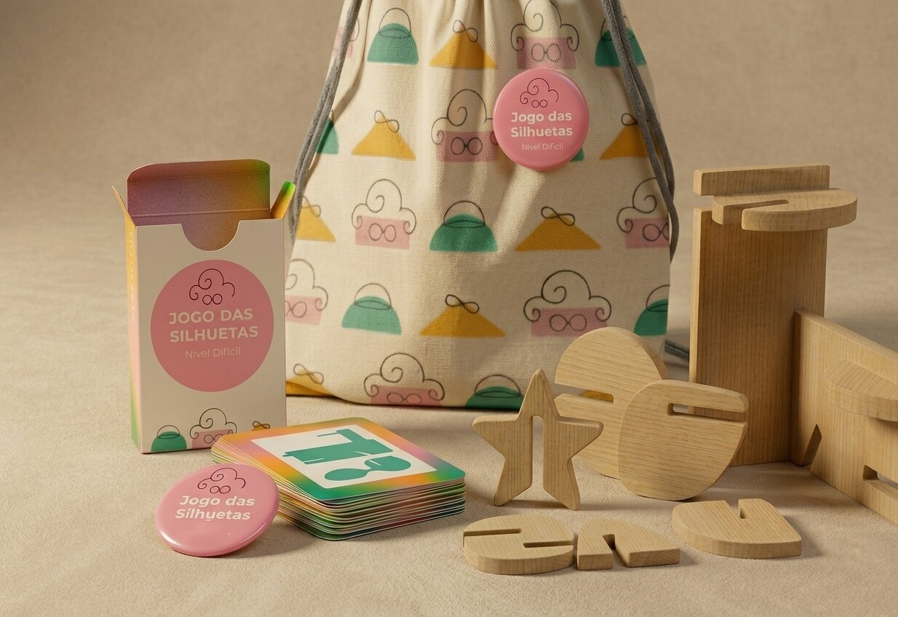

# Jogo das Silhuetas

<!--
  HERO: idealmente uma pseudo-sessão fotográfica do produto
  (ver tutorial Pletor.ai nos Recursos da disciplina, em
  /Recursos/AI_exps/). Usa attachments/hero.jpg para o frontmatter.
-->

> Desafiar a mente a descobrir como se reconstrói em 3D a silhueta desenhada na carta.

## Conceito

O **Jogo das Silhuetas** é um jogo de raciocínio e percepção espacial é composto por peças de madeira com formas orgânicas com encaixes deslizantes, acompanhado por um baralho de cartas que apresentam uma silhueta para decifrar.

- **O que é:** Um quebra-cabeça tridimensional onde o objetivo é replicar a silhueta bidimensional ilustrada na carta.
    
- **Para quem:** Crianças a partir dos 4/5 anos, jovens, adultos e idosos que procuram desafios para treinar o cérebro.
    
- **Porquê:** O produto estimula a transição do 2D (a imagem da carta) para o plano 3D (a construção física). Promove a paciência, exercita a coordenação motora fina e o raciocínio lógico.

## Enquadramento

O projeto surge no âmbito da marca Nestor e foi desenvolvido a partir da análise e do redesenho do sistema construtivo TomTect, redesenhei o seu princípio modular através da integração dos encaixes diretamente nas peças de madeira. Enquanto a Tomtect usa conectores de plástico para unir as peças de madeira, o sistema de encaixe que usei simplifica o material usado e elimina o plástico, integra a união entre peças de madeira através de encaixes deslizantes. As peças e as suas formas foram influenciadas pelo trabalho da artista Misha Milovanovich, que utiliza formas orgânicas nos seus trabalhos. O resultado desta combinação é um produto que combina construção, desafio e expressão, adaptando-se aos diferentes níveis da coleção. (ver [contexto](../../contexto.md)) 

## Tecnologia

Materiais (espécie de madeira): Pinus https://www.redepro.com/p/10092193/compensado-pinus-10mm-250-x-160-drabecki, processos de fabrico: CNC, software paramétrico: Autodesk Fusion 360. 

- Modelo 3D: <!-- embed Fusion ou link a360.co -->

## Função

### Como se brinca?

 - O jogador retira uma carta do baralho, que lhe vai mostrar uma silhueta de uma estrutura.
    
 - O jogador deve analisar a silhueta e selecionar as peças de madeira que possam pertencer à respetiva silhueta e quais são formas necessárias para recriar aquele contorno.
    
 -  O jogador deve utilizar o sistema de **encaixe deslizante**, monta as peças no ângulo e posição corretos até que a projeção da sua construção física corresponda à imagem da carta.

## Apresentação

Imagens-chave que sintetizam o produto final.

---

## Processo

O percurso completo de iterações, modelos e pesquisa está em [processo.md](processo.md), organizado do **mais recente** para o **mais antigo**.

[Ver processo completo →](processo.md)
